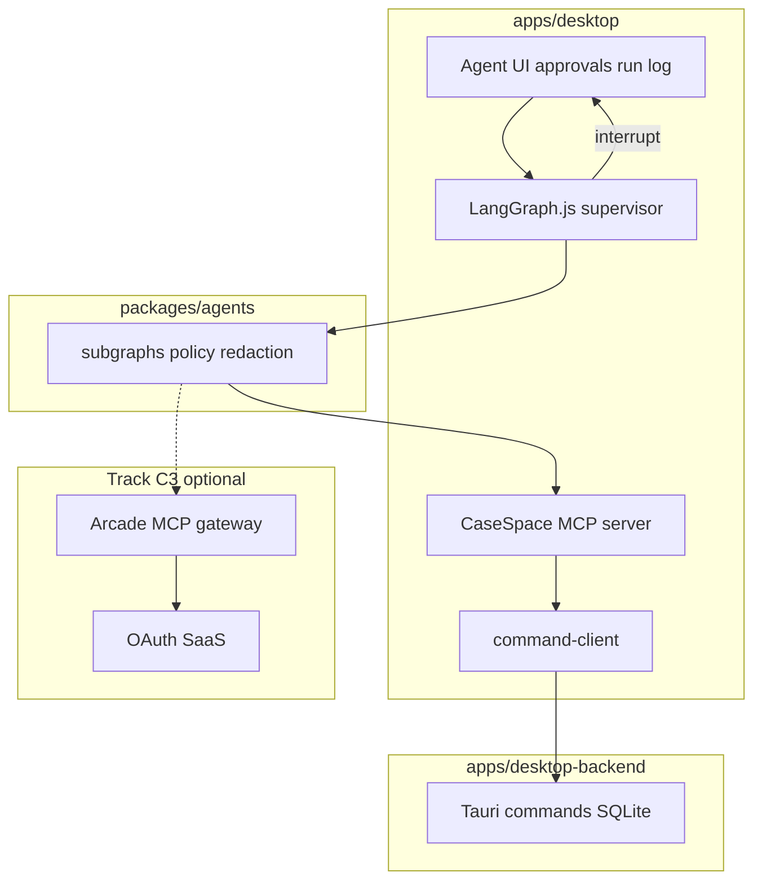

# Agent Architecture (AINative)

**Status:** Adopted (2026-05-21)  
**Tracks:** UX Parity Build Gate (Track A) → Agent platform (Track C)  
**Related:** [architecture.md](architecture.md), [ai-capability-matrix.md](spec/ai-capability-matrix.md), [command-parity-ledger.md](command-parity-ledger.md)

## Goals

1. **Examination reports generated** from live case data (`generate_case_report` / structured workspace) — findings, timeline, and evidence index first (CFE deliverable); not v1 export-button workflows.
2. **Guardrailed autonomous agents** run routine **fraud examination** work on the existing Tauri command surface (search, triage, draft artifacts, report sections).
3. **Destructive ops never auto-execute** — human confirm via graph interrupt (per [out-of-scope.md](spec/out-of-scope.md), with Agent mode DR below).

## Non-goals (v1 agent MVP)

- Porting v1 `export_case_report` UX
- Putting orchestration logic in Rust (`desktop-backend` stays domain-only)
- Auto-merge duplicates or auto-delete without approval
- Arcade.dev for native case file / SQLite mutations

## Stack (three layers)



| Layer | Technology | Responsibility |
|-------|------------|----------------|
| **Orchestration** | [LangGraph.js](https://langchain-ai.github.io/langgraph/) (`@langchain/langgraph`, `@langchain/core` only) | Supervisor + subgraphs, Sqlite checkpointer, `interrupt()` for confirm |
| **Native tools** | CaseSpace **MCP** (`@modelcontextprotocol/sdk`) | Tools call `command-client` → Tauri; no duplicate domain logic |
| **External tools** | [Arcade.dev](https://www.arcade.dev/) MCP gateway (later) | OAuth, credential vault, audit for Gmail/Slack/etc. |
| **LLM** | Provider-agnostic + redacted-cloud default | See [ai-capability-matrix.md](spec/ai-capability-matrix.md) |
| **Streaming UI** | Vercel AI SDK (optional) | Token stream in Agent panel; not the workflow engine |

## Orchestrator selection (ADR)

| Option | Verdict |
|--------|---------|
| **LangGraph.js** | **Default** — checkpoints, subgraphs, HITL interrupts fit case-long runs |
| **Mastra** | Fallback if C0 spike shows LangGraph friction on Tauri/Next |
| **OpenAI Agents SDK** | Good for simple loops + Arcade; weaker checkpoint/HITL |
| **Arcade alone** | Tool/auth runtime only, not orchestrator |
| **Custom agent loop** | Rejected — rebuilds interrupts/audit |

**C0 spike (gate before `packages/agents`):** report subgraph + one `confirm_required` tool + Sqlite checkpoint under app data dir. Document results in this file § Spike log.

## Tool policy

Enforced in graph middleware (not prompt-only):

| Tier | Examples | Behavior |
|------|----------|----------|
| `autonomous` | `load_case_files`, `search_all`, `generate_case_report`, `create_note`, `update_file_status` | Run and continue |
| `confirm_required` | `delete_case`, `remove_file_from_case`, `merge_duplicate_metadata` | `interrupt()` → desktop approval → resume |
| `human_only` | Raw-cloud opt-in, billing rate changes | Propose only; user acts in UI |

## Package layout (target)

```
packages/agents/          # consumed by apps/desktop only
  src/tools/              # Zod schemas from @repo/types + command ledger
  src/mcp/                # CaseSpace MCP server
  src/graphs/             # supervisor, triage, artifacts, report_generation
  src/policy/             # tool-policy, redaction
  src/checkpoint/         # SqliteSaver → casespace.db / agent_runs

apps/desktop/components/agents/   # Agent mode UI, approvals queue
```

## Subgraphs (priority)

1. **`report_generation`** — load case → section assembly → `generate_case_report` → interrupt for human review in reports workspace  
2. **`triage`** — post-sync status suggestions (AI-01)  
3. **`artifacts`** — draft notes/findings/timeline (AI-02/03)  

## Boundaries (elite architecture)

- **apps/desktop** — UX + LangGraph + MCP + `command-client` only  
- **apps/desktop-backend** — commands, SQLite, FTS; no LangChain  
- **apps/web** — no agent runtime  
- **packages/types** — shared contracts for tools and IPC  

## PII and runtime tiers

Per [ai-capability-matrix.md](spec/ai-capability-matrix.md): default **redacted-cloud**; raw paths/secrets stripped in `packages/agents/src/policy/redaction.ts` before LLM calls.

## Decision records

| Date | Decision |
|------|----------|
| 2026-05-21 | Adopt LangGraph + CaseSpace MCP + optional Arcade; v1 export port out of scope |
| 2026-05-21 | Agent mode: routine ops autonomous; destructive ops require confirm (DR-AGENT-001 in [discovery-appendix.md](spec/discovery-appendix.md)) |

## Spike log

| Date | LangGraph | Mastra | Notes |
|------|-----------|--------|-------|
| 2026-05-21 | pass (scaffold) | — | `@repo/agents` package: tool policy, report/supervisor graphs, MCP tool defs; desktop `AgentPanel` + approvals queue |
| 2026-05-22 | pass (build + tests green) | — | Released alongside v0.1.8. Scaffolding compiled into desktop via workspace dep; tool policy covered by Vitest. C0 hardening (Sqlite checkpoint + redaction module + first confirm round-trip) remains before C1 |

## Implementation phases

| Track | Scope | Status |
|-------|-------|--------|
| **C0** Scaffold + spike | `packages/agents` skeleton, policy table, report/supervisor graph stubs, desktop `AgentPanel`/`ApprovalsQueue` | **Shipped in 0.1.8** |
| **C1** MCP server + native bridge | `packages/agents/src/mcp/server.ts` exposing CaseSpace native commands via `command-client` proxy; `agent_runs` table + Sqlite checkpointer | next |
| **C2** Graphs + UI wiring | Wire `report_generation` subgraph into `AgentPanel` → live token stream; `interrupt()` round-trip surfaces in `ApprovalsQueue` | after C1 |
| **C3** Arcade external | Optional Gmail/Slack via Arcade MCP gateway; raw-cloud opt-in toggle | post-UX gate |
| **C4** Validation + AINative GA | E2E for autonomous + confirm-required flows; redaction tests; ship behind feature flag | gates AINative GA |

C0 deliverables verified in 0.1.8:

- `packages/agents/src/policy/tool-policy.ts` enforces `confirm_required` for `delete_case`, `merge_duplicate_metadata`, `remove_file_from_case`
- `createReportGenerationGraph` + `createSupervisorGraph` compile against `@langchain/langgraph@^0.4`
- `apps/desktop/components/agents/agent-panel.tsx` renders a side panel with run log + approvals queue (UI stub, no live runs yet)

C1 entry criteria (do not start before this is true):

1. v0.1.8 ships and passes `pnpm ops:validate:local`
2. UX release gate (native E2E checklist) green — see [product-roadmap.md](product-roadmap.md)
3. Decision recorded for LLM provider default (redacted-cloud vs. local-only)

## Report generation integration plan

Current native command (preserved, non-breaking): `apps/desktop-backend/src-tauri/src/lib.rs::generate_case_report` builds narrative text from SQLite artifacts via `build_report_body(case_id, conn, "narrative")`. Desktop calls `commandClient.generateCaseReport(caseId)` from `reports-view.tsx`.

Agent overlay (C2):

1. Desktop `AgentPanel` → `createReportGenerationGraph().invoke({ caseId, status: "loading" })`
2. `load` node calls native `load_case_files`, `list_notes`, `list_findings`, `list_timeline` via MCP → `command-client`
3. `draft` node calls LLM with redacted context, streams sections into `ReportsView` (existing UI) via Vercel AI SDK channel
4. `review` node opens `interrupt()` → user clicks **Approve** in `ApprovalsQueue` → graph resumes and persists final text via `generate_case_report` (server of record stays SQLite)

Validation hooks for C2:

```bash
pnpm --filter @repo/agents test          # tool policy + (future) graph unit tests
pnpm test:parity                          # backend command paths
pnpm test:e2e --grep "report"             # agent run E2E (to be added)
pnpm ops:validate:local                   # full local gate
```

Out of scope until UX gate clears: ML-driven duplicate auto-merge, auto-summarize on ingest, Arcade SaaS connectors.
