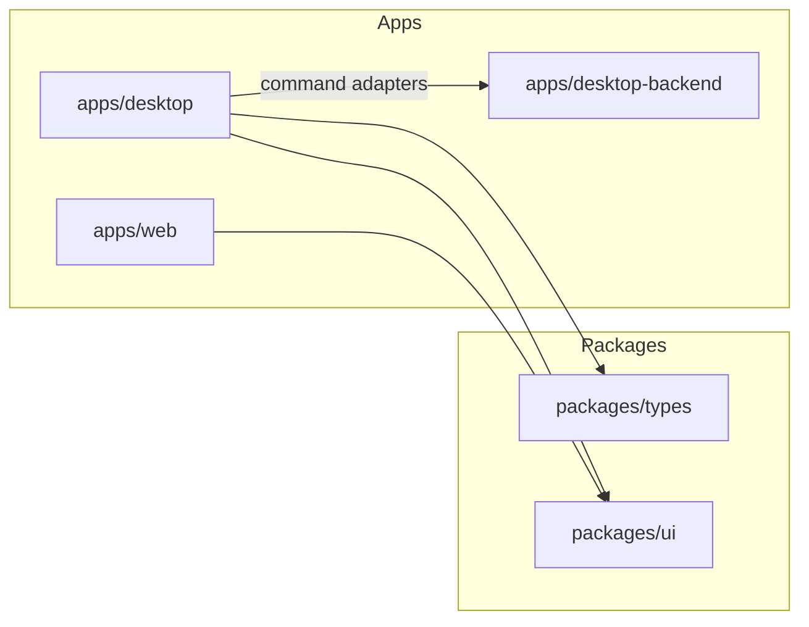

# CaseSpace v2 Architecture

Architecture target for CaseSpace v2. **Current state** and **target state** are distinguished below.

## System shape

CaseSpace v2 is a 3-app monorepo:

- `apps/desktop-backend`: native/core engine (Tauri + Rust)
- `apps/desktop`: desktop UX shell (Next.js)
- `apps/web`: marketing/sales/docs/download surface (no product workflow UI)

Shared packages: `packages/types`, `packages/ui`, shared configs.

**Note:** `apps/web` does not use `@repo/types` today. `apps/desktop-backend` uses inline Rust structs; target is shared contract alignment via serde + `packages/types`.

## Current implementation (today)

| Component | Reality |
|-----------|---------|
| `desktop-backend` | `lib.rs` + `database.rs`, `path.rs`, `search.rs`, `ingest.rs`; P0 non-AI commands; SQLite + FTS5; ingest v2 |
| `desktop` | Case hub + workspace shell (`components/case/*`, `components/workspace/*`, `components/viewer/*`, `components/artifacts/*`) |
| `web` | Marketing, download, static pages |
| Persistence | `casespace.db` (SQLite + WAL + FTS5); legacy JSON auto-imported once |
| Dev entry | `pnpm dev` → Tauri + Next via `dev:next` (single :3000) |
| Framework pin | Next **16.2.6** via `pnpm-workspace.yaml` catalog; lockfile + CI `--frozen-lockfile` |

## Target implementation (CoreParity UX + module split)

| Component | Target |
|-----------|--------|
| `desktop-backend` | `commands/*`, `domain/*`, `persistence/*` modules (split from monolithic `lib.rs`) |
| `desktop` | Expand `lib/hooks`, board/search/time/reports UI — see [ui-port-plan.md](ui-port-plan.md) U7–U10 |
| Contracts | `CommandResponse<T>` envelope, camelCase IPC aligned with `@repo/types` |

## Responsibility boundaries

### `apps/desktop-backend`

- Domain commands, persistence, file I/O, ingest, search, security policy

### `apps/desktop`

- Analyst workflows, UI state, command adapters, offline-first UX

### `apps/web`

- Marketing, download page, docs — no case workspace

## v1 relationship

v1 (`inventory-generator`) is React/Vite + Tauri 2 single app. v2 splits backend vs desktop vs web. **Preserve outcomes, redesign structure.**

See [v1-reference.md](v1-reference.md) and [migrating-from-v1.md](migrating-from-v1.md).

## Layering rules

1. Domain contracts (`packages/types`)
2. Backend implementation (`desktop-backend`)
3. Desktop adapters (`apps/desktop/lib/*`)
4. UI components (`apps/desktop/components/*`)

- UI never bypasses command adapters
- Commands never depend on UI
- AI modules (post-parity) sit above stable command layer

## Security model

- Case-scoped path canonicalization
- FTS query sanitization
- Destructive op confirmation + audit (P1)
- PII: redacted-cloud default ([spec/ai-capability-matrix.md](spec/ai-capability-matrix.md))

## Performance model

See [spec/perf-security-reliability-gates.md](spec/perf-security-reliability-gates.md).

## Phase sequencing

1. **Core Parity backend** — complete (local gate)
2. **Core Parity UX port** — U1–U6 done/MVP; U7–U11 next ([ui-port-plan.md](ui-port-plan.md))
3. **AINative** — blocked until UX Parity Build Gate; design locked in [architecture-agents.md](architecture-agents.md) (LangGraph + CaseSpace MCP + optional Arcade)

See [product-spec-bible.md](product-spec-bible.md).

## Agent runtime (AINative target)

| Component | Location |
|-----------|----------|
| LangGraph orchestration | `packages/agents` → `apps/desktop` |
| CaseSpace MCP tools | wraps `apps/desktop/lib/command-client.ts` |
| Domain / persistence | `apps/desktop-backend` (unchanged) |

Full ADR: [architecture-agents.md](architecture-agents.md).

## Related docs

- [architecture-agents.md](architecture-agents.md)
- [readiness.md](readiness.md)
- [ui-port-plan.md](ui-port-plan.md)
- [implementation-readiness-gate.md](implementation-readiness-gate.md)
- [command-parity-ledger.md](command-parity-ledger.md)
- [desktop-workflow-mapping.md](desktop-workflow-mapping.md)
