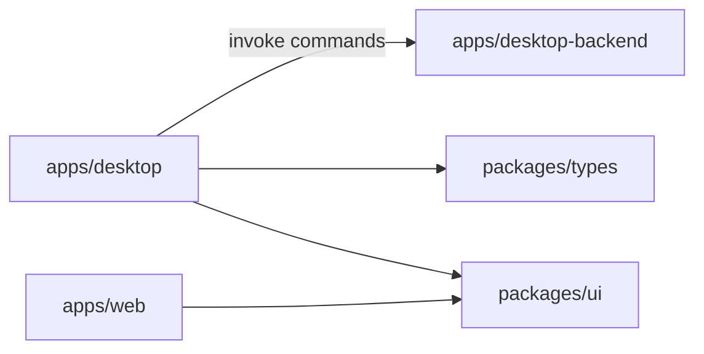

# CaseSpace Architecture

## System shape

3-app monorepo:

| App | Responsibility |
|-----|----------------|
| `apps/desktop-backend` | Tauri / Rust — commands, SQLite, ingest, search |
| `apps/desktop` | Next.js desktop UX — workflows, command adapters |
| `apps/web` | Marketing, download, docs (no case workspace) |

Shared: `packages/types`, `packages/ui`, `packages/agents`, workspace configs.

`apps/desktop-backend` has **no product UI**. Components call `lib/command-client.ts` only — never raw `invoke()` in UI.

## Persistence

- `casespace.db` — SQLite + WAL + FTS5
- One-time import from legacy JSON store on first open (if present)

## Development

| Command | Use |
|---------|-----|
| `pnpm dev` | Full desktop (Rust + Next :3000) |
| `pnpm dev:ui` | Next only — no native APIs |
| `pnpm dev:web` | Marketing :3001 |

Next.js **16.2.6** via `pnpm-workspace.yaml` catalog. CI uses `pnpm install --frozen-lockfile`.

## Layering

1. Contracts — `packages/types`
2. Engine — `desktop-backend`
3. Adapters — `apps/desktop/lib/*`
4. UI — `apps/desktop/components/*`

## Roadmap modules

Backend command surface may split into `commands/*`, `domain/*`, `persistence/*` over time. UX milestones: [product-roadmap.md](product-roadmap.md).

## AI (future)

Blocked until UX release gate. Design: [architecture-agents.md](architecture-agents.md).
