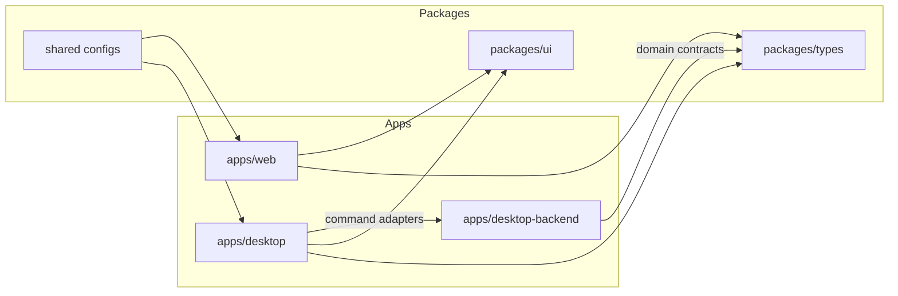

# CaseSpace v2 Architecture

This is the architecture target for CaseSpace v2.

## System shape

CaseSpace v2 is a 3-app monorepo:

- `apps/desktop-backend`: native/core engine (Tauri + Rust)
- `apps/desktop`: desktop UX shell (Next.js)
- `apps/web`: marketing/sales/docs/download surface (no product workflow interface)

Shared packages provide reusable contracts and UI primitives.

## Responsibility boundaries

### `apps/desktop-backend`

Owns:

- domain command layer
- persistence and schema migrations
- file-system interactions
- ingestion/scanning/extraction pipelines
- security-sensitive operations and capability policy

### `apps/desktop`

Owns:

- analyst-facing desktop workflows
- UI state orchestration
- typed command adapter layer to backend
- offline-first UX behavior

### `apps/web`

Owns:

- marketing/positioning pages
- release-aware desktop download UX
- docs/pricing/contact entry points
- no case workspace or native command workflows

## v1 to v2 architectural relationship

v1 is a single-package desktop application. v2 intentionally separates concerns:

- backend-native concerns move into `apps/desktop-backend`
- desktop UX concerns move into `apps/desktop`
- marketing/download/docs experience is isolated to `apps/web`

This separation improves modularity, maintainability, and long-term scalability.

## Domain and contract layering

Target layering:

1. Domain contracts (`packages/types`)
2. Backend command/domain implementation (`apps/desktop-backend`)
3. Desktop adapters and workflows (`apps/desktop/lib/*`)
4. Presentation components (`apps/desktop/components/*`)

Rules:

- UI never bypasses command adapters.
- Commands never depend on UI modules.
- Shared contract types are versioned and explicit.

## Security model

Key controls:

- strict path validation for file operations
- constrained capability permissions
- sanitized and bounded search queries
- guarded destructive operations with explicit UX confirmation

## Performance model

Core goals:

- preserve v1-grade ingest and search performance outcomes
- enforce p95 budgets for interactive workflows
- isolate heavy workloads in backend/native layers
- keep desktop UI responsive through async orchestration

## Extensibility model

CaseSpace v2 is closed-source-first today, but architecture is extension-ready:

- feature flags at module boundaries
- domain contracts that support optional premium modules later
- additive monetization paths that do not mutate core business logic

## Current implementation boundaries

- Implemented today: backend commands use lightweight JSON-store scaffolding
- Implemented today: desktop workflows are initial vertical slices
- Remaining: full v1 parity, production persistence model, and production OCR/AI/report automation
- Remaining for sign-off: live remote CI/release execution evidence

See `docs/readiness.md` and `docs/migrating-from-v1.md` for migration sequencing and gate criteria.
