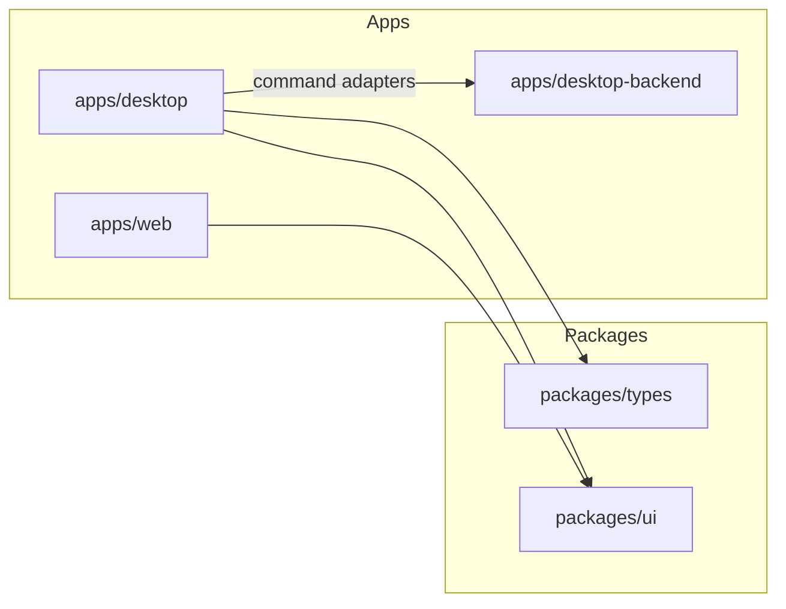

# CaseSpace v2 Architecture

Architecture target for CaseSpace v2. **Current state** and **target state** are distinguished below.

## System shape

CaseSpace v2 is a 3-app monorepo:

- `apps/desktop-backend`: native/core engine (Tauri + Rust)
- `apps/desktop`: desktop UX shell (Next.js)
- `apps/web`: marketing/sales/docs/download surface (no product workflow UI)

Shared packages: `packages/types`, `packages/ui`, shared configs.

**Note:** `apps/web` does not use `@repo/types` today. `apps/desktop-backend` uses inline Rust structs; target is shared contract alignment via serde + `packages/types`.

## Current implementation (today)

| Component | Reality |
|-----------|---------|
| `desktop-backend` | Single `lib.rs`, ~20 commands, JSON file store |
| `desktop` | `case-workspace.tsx` demo + partial `command-client.ts` |
| `web` | Marketing, download, static pages |
| Persistence | `casespace-v2-store.json` (scaffold only) |
| Search | In-memory substring (not production) |

## Target implementation (CoreParity)

| Component | Target |
|-----------|--------|
| `desktop-backend` | `commands/*`, `domain/*`, `persistence/*` modules |
| Persistence | SQLite + WAL + migrations + FTS5 |
| `desktop` | `lib/services`, `lib/hooks`, `lib/state`, `components/workspace/*` |
| Contracts | `CommandResponse<T>` envelope, camelCase IPC |

## Responsibility boundaries

### `apps/desktop-backend`

- Domain commands, persistence, file I/O, ingest, search, security policy

### `apps/desktop`

- Analyst workflows, UI state, command adapters, offline-first UX

### `apps/web`

- Marketing, download page, docs — no case workspace

## v1 relationship

v1 (`inventory-generator`) is React/Vite + Tauri 2 single app. v2 splits backend vs desktop vs web. **Preserve outcomes, redesign structure.**

See [v1-reference.md](v1-reference.md) and [migrating-from-v1.md](migrating-from-v1.md).

## Layering rules

1. Domain contracts (`packages/types`)
2. Backend implementation (`desktop-backend`)
3. Desktop adapters (`apps/desktop/lib/*`)
4. UI components (`apps/desktop/components/*`)

- UI never bypasses command adapters
- Commands never depend on UI
- AI modules (post-parity) sit above stable command layer

## Security model

- Case-scoped path canonicalization
- FTS query sanitization
- Destructive op confirmation + audit (P1)
- PII: redacted-cloud default ([spec/ai-capability-matrix.md](spec/ai-capability-matrix.md))

## Performance model

See [spec/perf-security-reliability-gates.md](spec/perf-security-reliability-gates.md).

## Phase sequencing

**CoreParity first** → validate E2E → **AINative second**. See [product-spec-bible.md](product-spec-bible.md).

## Related docs

- [readiness.md](readiness.md)
- [implementation-readiness-gate.md](implementation-readiness-gate.md)
- [command-parity-ledger.md](command-parity-ledger.md)
