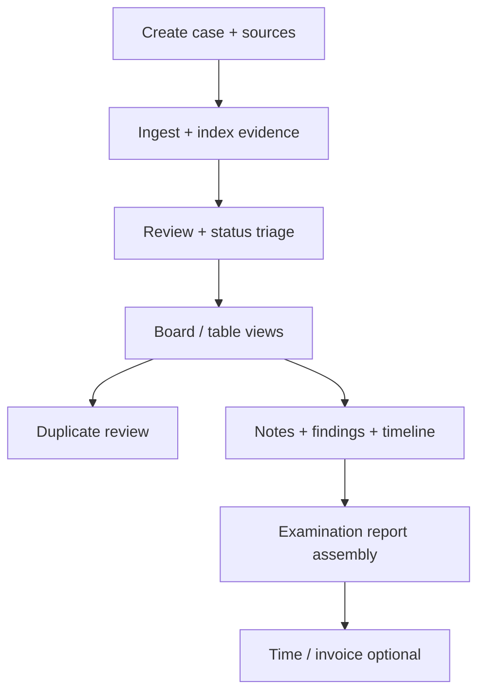

# CFE Workflow Specification (Primary Client)

**Status:** Adopted (2026-05-21)  
**Priority:** **P0** — all UX, report, and agent design decisions default to CFE/fraud-examination practice unless explicitly marked secondary.  
**Related:** [product-spec-bible.md](../product-spec-bible.md), [user-flow-map.md](user-flow-map.md), [user-flows-and-ux-invariants.md](user-flows-and-ux-invariants.md)

## Who we build for (launch)

| Priority | Role | Notes |
|----------|------|--------|
| **Primary** | **CFE** (Certified Fraud Examiner) and fraud-examination practitioners | Client wedge; ACFE-aligned examination mindset |
| Secondary | Solo private investigators, litigation support analysts | Same core workspace; template emphasis may differ |
| **Not primary** | Financial analysts, FP&A, corporate finance | Billing/time features support professional services but are **not** the product narrative |

CaseSpace is a **fraud examination and investigative evidence workspace**, not a financial modeling or analysis platform.

## CFE examination outcomes (what “done” looks like)

1. **Evidence corpus** — sources ingested, indexed, searchable, review statuses applied  
2. **Chronology** — timeline of relevant events with optional source-file linkage  
3. **Findings** — documented conclusions with severity and **linked evidence files**  
4. **Working notes** — interview memos, field notes, file-linked observations (rich text)  
5. **Duplicate / integrity signals** — duplicate groups reviewed; primary file chosen  
6. **Deliverable** — defensible **examination report** (narrative + findings + timeline + evidence index)  
7. **Engagement billing** (secondary) — time captured for client invoice; not the examination thesis

## Workflow map (CFE-first)

| Phase | CFE activity | CaseSpace surfaces | Commands / data |
|-------|----------------|-------------------|-----------------|
| Intake | Collect digital evidence | Add sources, sync, large-folder warning | `ingest_*`, `sync_case_all_sources` |
| Preservation | Know what was indexed | File table, hashes/metadata panel | `file_metadata`, viewer metadata |
| Examination | Review documents | Viewer, status workflow, board lanes | `update_file_status`, board DnD |
| Analysis | Flag integrity issues | Duplicates panel, merge primary | `find_duplicate_files`, `merge_duplicate_metadata` |
| Documentation | Record observations | Notes (file-linked), findings (linked files) | `create_note`, `create_finding` |
| Chronology | Reconstruct events | Timeline + ingest date hints | `create_timeline_event`, `source_file_id` |
| Synthesis | Prepare report | Reports workspace, `generate_case_report` | SQLite artifacts + files |
| Administration | Bill engagement | Timer, segments, billing config | `start_timer`, `calculate_billing_amount` |

## UX priorities for CFE (ordered)

1. **Evidence-first navigation** — file table, folder scope, preview, status, board swimlanes  
2. **Findings + timeline + linked files** — every conclusion traceable to evidence  
3. **Global search** — locate names, amounts, dates across corpus and artifacts  
4. **Duplicate management** — common in fraud matters (copies, versions, altered paths)  
5. **Examination report** — structured sections: findings → timeline → evidence index → executive summary  
6. **Time/billing** — present but de-emphasized in marketing and default report section order  

## Report deliverables (CFE vs financial)

| Deliverable | CFE priority | Default in UI |
|-------------|--------------|---------------|
| Investigation / examination narrative | **P0** | Primary generate action |
| Findings + timeline sections | **P0** | First tabs in reports workspace |
| Evidence index / inventory summary | **P0** | Prominent section |
| Executive summary | **P0** | After examination body |
| Billing / invoice package | P1 (engagement admin) | Legacy / secondary |
| Financial analysis package | **P2 / optional** | Not positioned for CFE client |

## Agent autonomy (CFE guardrails)

Per [architecture-agents.md](../architecture-agents.md):

| Autonomous (routine examination work) | Confirm required |
|---------------------------------------|------------------|
| Search corpus, suggest status, draft notes/findings | Delete case/file, merge duplicates |
| Assemble report sections from SQLite | Bulk destructive changes |
| Load metadata, list linked evidence | |

Agents must **cite linked files** in findings/timeline suggestions; never auto-merge duplicates without approval.

## Native E2E sign-off (CFE checklist)

In addition to [native-e2e-checklist.md](native-e2e-checklist.md), CFE client validation should explicitly pass:

- [ ] Ingest evidence folder; review statuses persist  
- [ ] Create finding with **linked files**; visible on finding card  
- [ ] Create timeline event with **source file**  
- [ ] Resolve duplicate group (primary + merge)  
- [ ] Board drag changes status; progress dashboard matches lanes  
- [ ] **Generate examination report**; findings and timeline sections populated  
- [ ] Search finds content in file and note  

## Decision record

| ID | Decision | Rationale |
|----|----------|-----------|
| DR-CFE-001 | CFE is primary launch persona | Actual paying client; examination workflows drive P0 UX |
| DR-CFE-002 | Financial analyst outputs deprioritized | Avoid wrong product story; keep commands for compatibility |
| DR-CFE-003 | Findings/timeline/evidence before billing in report UI | Matches examination deliverable order |

## Traceability

Update these when CFE scope changes:

- [product-spec-bible.md](../product-spec-bible.md) personas  
- [feature-catalog.md](feature-catalog.md) report feature tags  
- [user-flow-map.md](user-flow-map.md) FLOW-005/007  
- Desktop: `reports-workspace.tsx` section order, artifact panel placeholders  
- Web: marketing copy (`apps/web`)
