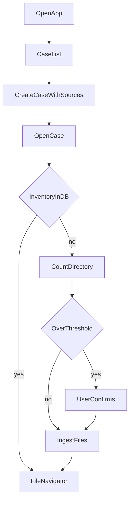
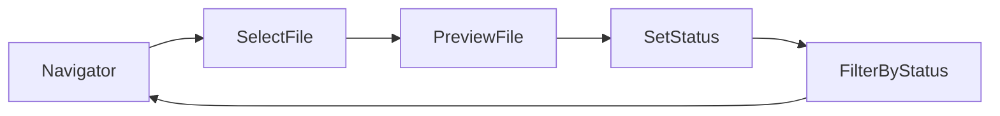

# User Flow Map

End-to-end flows for **CFE / fraud examination** launch (primary client). See [cfe-workflows.md](cfe-workflows.md). Each step links to features and phase tags.

## FLOW-001: Case setup and ingest (P0-CoreParity)

| Step | Feature IDs | Commands (target) | UI surface |
|------|-------------|-------------------|------------|
| Create case | F-CASE-01, F-CASE-03 | `create_case` | Case hub dialog |
| Open case | F-CASE-01, F-INGEST-01 | `load_case_files_with_inventory` | Workspace shell |
| Ingest | F-INGEST-01, F-INGEST-02 | `ingest_files_to_case` | Progress + navigator |

**Failure paths:** path error, cancel ingest, partial failure with retry  
**Tests:** e2e, integration, perf  
**AI role:** none

## FLOW-002: Review and triage (P0-CoreParity)

| Step | Feature IDs | Commands | UI |
|------|-------------|----------|-----|
| Preview | F-VIEW-01, F-VIEW-02, F-VIEW-04 | `read_file_text`, `open_file` | Viewer pane |
| Status | F-REVIEW-01 | `update_file_status` | Status control |

## FLOW-003: Artifacts (P0-CoreParity)

Notes, findings, timeline linked to case (and optionally file).

| Artifact | Create | List | Update/delete |
|----------|--------|------|---------------|
| Note | P0 | P0 | P0 target |
| Finding | P0 | P0 | P0 target |
| Timeline | P0 | P0 | P0 target |

## FLOW-004: Search (P0-CoreParity)

Cmd/Ctrl+K → query → ranked results → navigate to entity.

**AI:** none

## FLOW-005: Examination report (P0-CoreParity)

Aggregate findings, timeline, notes + evidence index → **generate_case_report** / reports workspace (CFE deliverable).

**AI:** none at CoreParity (templates only)

## FLOW-007: Duplicate / integrity review (P0-CoreParity, CFE)

Post-ingest duplicate groups → set primary → merge metadata (relink notes/findings/timeline).

| Step | Feature IDs | Commands |
|------|-------------|----------|
| Review groups | F-DUP-01 | `find_duplicate_files` |
| Resolve | F-DUP-01 | `mark_duplicate_primary`, `merge_duplicate_metadata` |

## FLOW-002b: Board evidence triage (P0-CoreParity, CFE)

Swimlane status workflow for high-volume document review — see [native-e2e-checklist.md](native-e2e-checklist.md) FLOW-002b.

## FLOW-006: Time and billing (P0-CoreParity)

Timer in header → entries → billing config → invoice export.

**Invariant:** timer stops on case switch (UX-003)

## AI-phase flow overlay (blocked)

After Core Parity gate — see [ai-capability-matrix.md](ai-capability-matrix.md).

| Flow step | AI role | Feature |
|-----------|---------|---------|
| Post-ingest | suggest | F-AI-05 auto-triage |
| File select | assist | F-AI-01 summary |
| Report view | suggest | F-AI-04 draft sections |
| Billing export | assist | F-AI-06 narrative |
